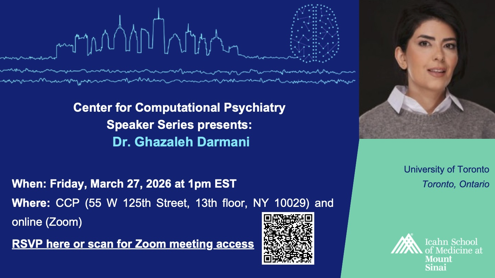

# Center for Computational Psychiatry Speaker Series 2025-2026

The Center for Computational Psychiatry (CCP), led by Dr. Laura Berner, hosts a monthly afternoon seminar series in which leading researchers from around the world present their latest findings in the fields of computational psychiatry, computational modeling, and cognitive neuroscience research. Discussion topics include transdiagnostic approaches to psychiatry and mental health, reinforcement learning and human decision-making, and computational models of social and affective processes. Speakers are hosted virtually and, when possible, in person at the CCP located at 55 West 125th Street, Suite 1302, New York, NY 10029.

Zoom link will be available upon registration.

For more information, please get in touch with Justice Simonetti, Cameron Le Roux, or Olivia Lauri

March Speakers:

<!-- a normal html comment, remove the outside long arrow to display poster -->

**2025/2026 Schedule** 

| Date       | Invited Speaker     | Registration | Recommended Reading |
| --- | --- | --- | --- |
| 2025/11/03 | Dr. Herman Cappelen | [Link](https://docs.google.com/forms/d/e/1FAIpQLSenL8fNuf-ytD5CQF8SmiybDgy5kva4_Wb0bDHjKpztRi4BPg/viewform?usp=sharing&ouid=114279085289570463718) | [Link](https://arxiv.org/pdf/2504.13988) |
| 2025/11/21 | Dr. Ryan Smith | [Link](https://docs.google.com/forms/d/e/1FAIpQLSfA-SAlxM8jP0D9V-tu_fMEK_SeFzhN7HrnG9lrBM8V3UInGA/viewform?usp=sharing&ouid=114279085289570463718) |  |
| 2025/12/05 | Dr. Simon Eickhoff | [Link](https://docs.google.com/forms/d/e/1FAIpQLSe5AIRQ1si4Ch7Tx165genIykCEMVzqfC8pA0yHs6aWD-5Hqg/viewform?usp=sharing&ouid=114279085289570463718) | [Link](https://www.sciencedirect.com/science/article/pii/S1053811920303463)   [Link](https://www.sciencedirect.com/science/article/pii/S1053811923003968)   [Link](https://pubmed.ncbi.nlm.nih.gov/39960115/) |
| 2026/01/16 | Dr. Aliona Tsypes | [Link](https://docs.google.com/forms/d/e/1FAIpQLSeecWkznMkVhzJlhRGI2RhSgZgk4SjhY1xlqwVa_md1GMT7RQ/viewform?usp=sharing&ouid=114279085289570463718) | [Link](https://pubmed.ncbi.nlm.nih.gov/38985462/)   [Link](https://pubmed.ncbi.nlm.nih.gov/34843269/) |
| 2026/02/13 | Dr. Ghazaleh Darmani | [Link](https://docs.google.com/forms/d/e/1FAIpQLSdCwuTNcnkZh-Wk1IK9HL7O2z5dn2PSQRU1FCKJP2WbmMRbeg/viewform?usp=sharing&ouid=114279085289570463718) |  |
| 2026/03/13 | Dr. Sarah Fineberg | [Link](https://docs.google.com/forms/d/e/1FAIpQLSfetPKAwxMznynRz7dXLQn6-Xm0bJwVeBZYBlOebahvK2VqeQ/viewform?usp=sharing&ouid=114279085289570463718) |  |
| 2026/04/17 | Dr. Christina Wierenga | [Link](https://docs.google.com/forms/d/e/1FAIpQLSdBVTGTKEVvLgdyvxV0EAwU5mJay7ikIZvBsBwDkOW_e90Ksw/viewform?usp=sharing&ouid=114279085289570463718) |  |
| 2026/05/01 | Dr. Inês Pereira | [Link](https://docs.google.com/forms/d/e/1FAIpQLSepKB1EWvkssKNS7Ezof0EVOOsju6Mgz6ZUZLrQDr6hKb7-7g/viewform) | [Link](https://www.research-collection.ethz.ch/entities/publication/e723c0e4-b9bc-4f1e-9021-22d6958dfd5f)   [Link](https://www.preprints.org/manuscript/202510.0133) |
| 2026/06/26 | Dr. Ingo Willuhn | [Link](https://docs.google.com/forms/d/e/1FAIpQLSdY6FqnTHheWsIEJhMnqbBVHb4jjTN1jeTtMEOgOtR3zViU_A/viewform?usp=sharing&ouid=114279085289570463718) |  |

**2024/2025 Schedule** 

| Date       | Invited Speaker     | Registration | Recommended Reading |
| --- | --- | --- | --- |
| 2025/05/28 | Dr. Ming Hsu | [Link](https://forms.gle/A5xp9f393eVbE8io8) | [Link](https://journals.plos.org/plosone/article?id=10.1371/journal.pone.0304723)   [Link](https://www.pnas.org/doi/10.1073/pnas.2116944119)   [Link](https://www.pnas.org/doi/10.1073/pnas.1719452115) |
| 2025/04/18 | Dr. Peter Dayan |  |  |
| 2025/03/21 | Dr. Nicolas Schuck |  |  |
| 2025/03/07 | Dr. Marcelo Mattar |  |  |
| 2025/02/28 | Dr. Alan Simmons | [Link](https://forms.gle/1R7Gb2FHu7hqDo4e8) | [1](https://www.sciencedirect.com/science/article/pii/S0149763424002197)   [2](https://journals.lww.com/pain/fulltext/2024/08000/identification_of_group_differences_in_predictive.10.aspx) |
| 2025/01/24 | Dr. Cecilia Hinojosa | [Link](https://forms.gle/Nw1a6w74Un4jKfCj9) | [Link](https://www.sciencedirect.com/science/article/pii/S2451902224002830?via%3Dihub) |
| 2024/12/13 | Dr. Alexandre Pouget | [Link](https://forms.gle/LjAJoRUXZP9tbQVE7) | [Link](https://www.biorxiv.org/content/10.1101/2023.07.04.547684v1) |
| 2024/09/20 | Dr. Annie Haynos    | [Link]( https://forms.gle/7vieMoJtpsC3GRQw7) | [Link](https://link.springer.com/article/10.1007/s11920-022-01320-9) |

**2023 Schedule** 

| Date       | Invited Speaker     | Registration |
| --- | --- | --- |
| 2023/09/29 | Dr. Tobias Hauser   | [Link](https://forms.gle/456ekX3tS3GSWsEA7) |
| 2023/10/20 | Dr. Ian Ballard     | [Link](https://forms.gle/9UjAC5VQjK82dNEAA) |
| 2023/11/17 | Dr. Ifat Levy       | [Link](https://forms.gle/iikoNNXwHVXmQhMX9) |
| 2024/01/26 | Dr. Caroline Charpentier | [Link](https://forms.gle/QoQo5oAPwZM4ydZ19 ) |
| 2024/02/23 | Casper Hesp     | [Link](https://docs.google.com/forms/d/e/1FAIpQLSfnWEJJhjyA800U-FTM35zJFDRRSP-wrown3bJK73MjpmBCtQ/viewform) |
| 2024/03/08 | Dr. David Redish | (FBI Speaker Series) |
| 2024/04/19 | Dr. Jonathan Roiser | [Link](https://forms.gle/1hfjJTsioABCXNTP8) |
| 2024/05/21 | Dr. Quentin Huys  | [Link](https://forms.gle/zJmxtkchRir2GLkRA) |
| 2024/05/31 | Dr. Lucina Uddin  | [Link](https://forms.gle/zfVBa85fcBLwdP2n9) |
