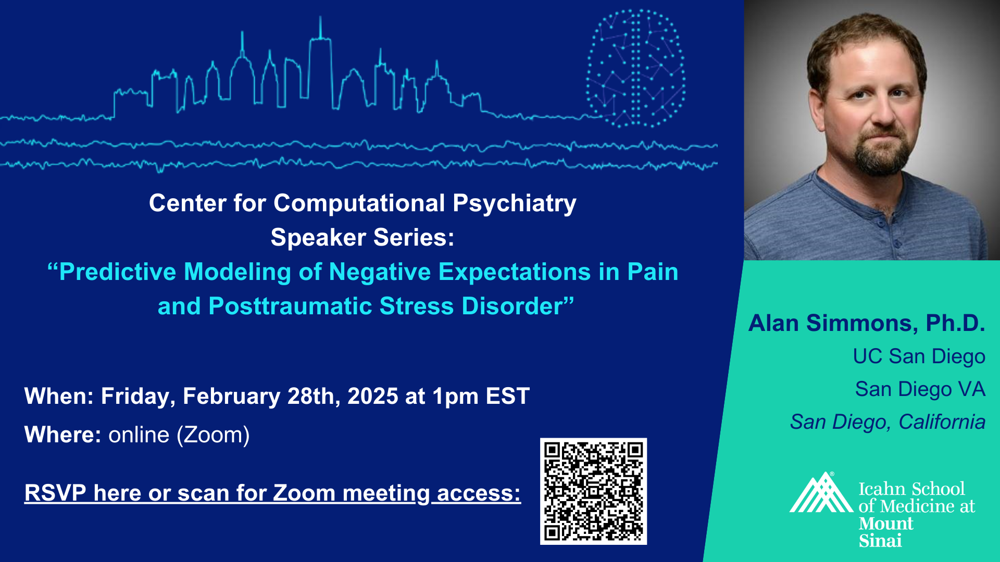

# Center for Computational Psychiatry Speaker Series 2024-2025

The Center for Computational Psychiatry (CCP), led by Dr. Xiaosi Gu, hosts a monthly afternoon seminar series in which leading researchers from around the world present their latest findings in the fields of computational psychiatry, computational modeling, and cognitive neuroscience research. Discussion topics include transdiagnostic approaches to psychiatry and mental health, reinforcement learning and human decision-making, and computational models of social and affective processes. Speakers are hosted virtually and, when possible, in person at the CCP located at 55 West 125th Street, Suite 1302, New York, NY 10029.

Zoom link will be available upon registration.

For more information, please get in touch with Saren Seeley at `saren.seeley@mssm.edu`, Jacqueline Beltran at `jacqueline.beltran@icahn.mssm.edu`, Jing Li at `jing.li@icahn.mssm.edu`, or Karina Savillo at `karina.savillo@mssm.edu`.

**2024/2025 Schedule** 

| Date       | Invited Speaker     | Registration | Recommended Reading |
| --- | --- | --- | --- |
| 2025/02/28 | Dr. Alan Simmons | [Link](https://forms.gle/1R7Gb2FHu7hqDo4e8)| [[1]](https://www.sciencedirect.com/science/article/pii/S0149763424002197) [[2]](https://journals.lww.com/pain/fulltext/2024/08000/identification_of_group_differences_in_predictive.10.aspx) |
| 2025/01/24 | Dr. Cecilia Hinojosa | [Link](https://forms.gle/Nw1a6w74Un4jKfCj9)| [Link](https://www.sciencedirect.com/science/article/pii/S2451902224002830?via%3Dihub) |
| 2024/12/13 | Dr. Alexandre Pouget | [Link](https://forms.gle/LjAJoRUXZP9tbQVE7) | [Link](https://www.biorxiv.org/content/10.1101/2023.07.04.547684v1) |
| 2024/09/20 | Dr. Annie Haynos    | [Link]( https://forms.gle/7vieMoJtpsC3GRQw7) | [Link](https://link.springer.com/article/10.1007/s11920-022-01320-9) |

**2023 Schedule** 

| Date       | Invited Speaker     | Registration |
| --- | --- | --- |
| 2023/09/29 | Dr. Tobias Hauser   | [Link](https://forms.gle/456ekX3tS3GSWsEA7) |
| 2023/10/20 | Dr. Ian Ballard     | [Link](https://forms.gle/9UjAC5VQjK82dNEAA) |
| 2023/11/17 | Dr. Ifat Levy       | [Link](https://forms.gle/iikoNNXwHVXmQhMX9) |
| 2024/01/26 | Dr. Caroline Charpentier | [Link](https://forms.gle/QoQo5oAPwZM4ydZ19 ) |
| 2024/02/23 | Casper Hesp     |[Link](https://docs.google.com/forms/d/e/1FAIpQLSfnWEJJhjyA800U-FTM35zJFDRRSP-wrown3bJK73MjpmBCtQ/viewform)|
| 2024/03/08 | Dr. David Redish | (FBI Speaker Series)     |
| 2024/04/19 | Dr. Jonathan Roiser | [Link](https://forms.gle/1hfjJTsioABCXNTP8) |
| 2024/05/21 | Dr. Quentin Huys  | [Link](https://forms.gle/zJmxtkchRir2GLkRA)  |
| 2024/05/31 | Dr. Lucina Uddin  | [Link](https://forms.gle/zfVBa85fcBLwdP2n9)  |

<!-- a normal html comment, remove the outside long arrow to display poster -->

